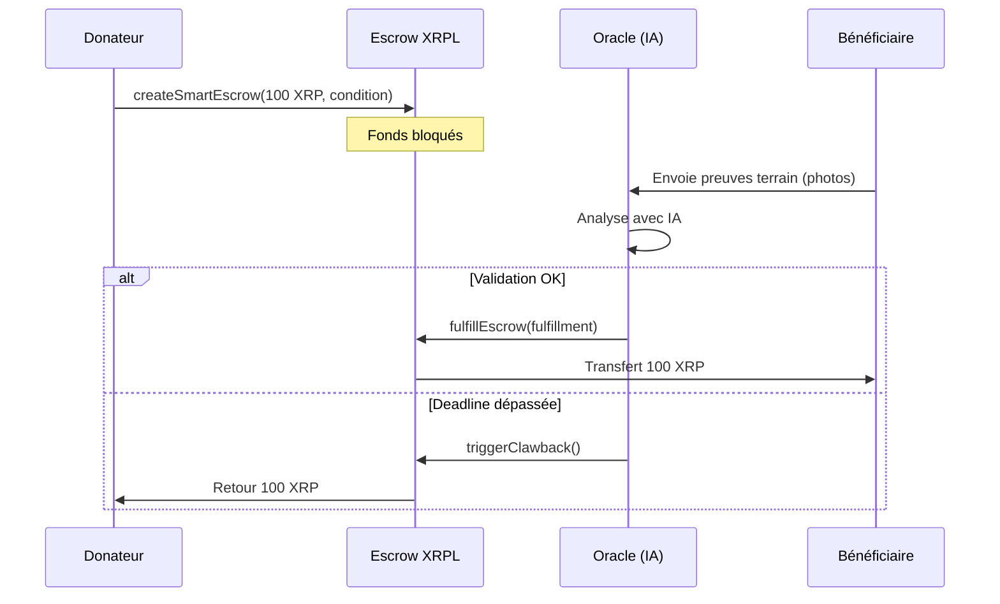

# Smart Escrow Service - XRPL Impact Map

## 📋 Vue d'ensemble

`SmartEscrowService` est un service TypeScript pour gérer des **dons conditionnels** sur le XRPL (XRP Ledger). Il simule le standard XLS-100 en utilisant des **Escrows avec Crypto-Conditions (PreimageSha256)**.

### Concept
Les fonds sont bloqués dans un escrow et ne peuvent être débloqués que si un **Oracle (backend IA)** valide les preuves terrain (photos, rapports, etc.). C'est le cœur du système "Tech for Good" de XRPL Impact Map.

### Architecture
```
Donateur → Escrow (avec Condition) → Validation Oracle → Bénéficiaire (ONG)
                 ↓
          (si deadline dépassée)
                 ↓
          Clawback → Donateur
```

---

## 🚀 Installation

### Prérequis
- Node.js >= 16
- npm ou yarn
- Wallets XRPL Testnet financés ([Faucet](https://xrpl.org/xrp-testnet-faucet.html))

### Installer les dépendances

```bash
npm install xrpl five-bells-condition @types/node
```

---

## 📖 Utilisation

### Import du service

```typescript
import SmartEscrowService from './SmartEscrowService';
import { Wallet } from 'xrpl';

const service = new SmartEscrowService('wss://s.altnet.rippletest.net:51233');
```

### Exemple 1: Créer un don conditionnel

```typescript
// 1. Générer un secret Oracle aléatoire
const oracleSecret = service.generateRandomSecret();

// 2. Le donateur crée l'escrow
const escrowInfo = await service.createSmartEscrow({
  donorSeed: 'sXXXXXXXXXXXXXXXXXXXXXXXXX',
  amount: '100', // 100 XRP
  beneficiary: 'rBeneficiaryAddress...',
  oracleSecret: oracleSecret,
  deadline: '2024-12-31T23:59:59Z', // Optionnel
});

console.log('Escrow créé:', escrowInfo.txHash);
console.log('Sequence:', escrowInfo.sequence);
console.log('⚠️ Fulfillment à stocker:', escrowInfo.fulfillment);
```

**Important**: Le `fulfillment` doit être stocké en sécurité côté Oracle. C'est lui qui débloquera les fonds.

### Exemple 2: Débloquer les fonds (après validation IA)

```typescript
// L'Oracle (backend IA) débloque après validation
const oracleWallet = Wallet.fromSeed('sOracleWalletSeed...');

const txHash = await service.fulfillEscrow(
  oracleWallet,
  escrowInfo.owner,
  escrowInfo.sequence,
  oracleSecret // Le même secret utilisé lors de la création
);

console.log('Fonds débloqués:', txHash);
```

### Exemple 3: Paiements fractionnés (Milestones)

Pour un projet avec 3 jalons (30% / 50% / 20%):

```typescript
import { Milestone } from './SmartEscrowService';

const milestones: Milestone[] = [
  {
    percentage: 30,
    description: 'Démarrage',
    oracleSecret: service.generateRandomSecret(),
    deadline: Date.now() / 1000 + 7 * 24 * 60 * 60, // 7 jours
  },
  {
    percentage: 50,
    description: 'Phase intermédiaire',
    oracleSecret: service.generateRandomSecret(),
    deadline: Date.now() / 1000 + 14 * 24 * 60 * 60,
  },
  {
    percentage: 20,
    description: 'Finalisation',
    oracleSecret: service.generateRandomSecret(),
    deadline: Date.now() / 1000 + 30 * 24 * 60 * 60,
  },
];

const escrows = await service.createMilestoneEscrows(
  {
    donorSeed: 'sXXXXXXXXXXXXXXXXXXXXXXXXX',
    amount: '100',
    beneficiary: 'rBeneficiaryAddress...',
    oracleSecret: 'not-used',
  },
  milestones
);

console.log(`${escrows.length} escrows créés`);

// Débloquer le jalon 1
await service.fulfillEscrow(
  oracleWallet,
  escrows[0].owner,
  escrows[0].sequence,
  milestones[0].oracleSecret
);
```

### Exemple 4: Clawback (Récupération des fonds)

Si la deadline est dépassée et que l'Oracle n'a pas validé:

```typescript
const anyWallet = Wallet.fromSeed('sAnyWalletSeed...');

const txHash = await service.triggerClawback(
  anyWallet, // N'importe qui peut déclencher
  escrowInfo.owner,
  escrowInfo.sequence
);

console.log('Fonds retournés au donateur:', txHash);
```

---

## 🔐 Crypto-Conditions (Comment ça marche?)

### PreimageSha256 Condition

1. **Création**: L'Oracle génère un secret aléatoire (preimage).
2. **Condition**: Le hash SHA256 du secret est stocké dans l'escrow.
3. **Fulfillment**: Pour débloquer, l'Oracle fournit le secret original.
4. **Validation**: Le XRPL vérifie que `SHA256(secret) == condition`.

### Génération manuelle

```typescript
// Générer un secret
const secret = service.generateRandomSecret();
// → '3f2a5b8c9d1e4f6a7b8c9d0e1f2a3b4c5d6e7f8a9b0c1d2e3f4a5b6c7d8e9f0'

// Le service génère automatiquement:
// - Condition (hex) : Hash SHA256 du secret
// - Fulfillment (hex) : Le secret encodé pour le XRPL
```

---

## 📚 API Reference

### `SmartEscrowService`

#### Constructeur
```typescript
constructor(xrplServerUrl?: string)
```
- **xrplServerUrl**: URL du serveur XRPL (défaut: Testnet)

#### Méthodes principales

##### `createSmartEscrow(config: EscrowConfig): Promise<EscrowInfo>`
Crée un escrow conditionnel.

**Paramètres:**
- `donorSeed`: Seed du wallet donateur
- `amount`: Montant en XRP (string)
- `beneficiary`: Adresse du bénéficiaire
- `oracleSecret`: Secret Oracle pour générer la condition
- `deadline`: (Optionnel) Date limite pour le clawback

**Retourne:** `EscrowInfo` avec `txHash`, `sequence`, `condition`, `fulfillment`.

##### `fulfillEscrow(wallet, ownerAddress, escrowSequence, oracleSecret): Promise<string>`
Débloque un escrow en fournissant le secret Oracle.

**Paramètres:**
- `wallet`: Wallet pour signer (peut être n'importe qui)
- `ownerAddress`: Adresse du créateur de l'escrow
- `escrowSequence`: Numéro de séquence de la transaction EscrowCreate
- `oracleSecret`: Secret Oracle pour générer le fulfillment

**Retourne:** Hash de la transaction.

##### `triggerClawback(wallet, ownerAddress, escrowSequence): Promise<string>`
Annule un escrow expiré et retourne les fonds au donateur.

**Paramètres:**
- `wallet`: Wallet pour signer
- `ownerAddress`: Adresse du créateur de l'escrow
- `escrowSequence`: Numéro de séquence

**Retourne:** Hash de la transaction.

##### `createMilestoneEscrows(config, milestones): Promise<EscrowInfo[]>`
Crée plusieurs escrows pour des paiements fractionnés.

**Paramètres:**
- `config`: Configuration de base (montant total)
- `milestones`: Tableau de `Milestone` avec pourcentages

**Retourne:** Tableau de `EscrowInfo`.

##### `generateRandomSecret(): string`
Génère un secret aléatoire de 32 bytes (64 caractères hex).

##### `getEscrowInfo(ownerAddress, escrowSequence): Promise<any | null>`
Récupère les informations d'un escrow depuis le ledger.

---

## 🛡️ Gestion des erreurs

Le service gère automatiquement:
- ✅ Validation des paramètres manquants
- ✅ Vérification des fonds insuffisants
- ✅ Gestion des deadlines invalides
- ✅ Erreurs réseau XRPL
- ✅ Échecs de transactions

Exemple:

```typescript
try {
  const escrowInfo = await service.createSmartEscrow({...});
} catch (error) {
  console.error('Erreur:', error.message);
  // Gérer l'erreur (retry, notification, etc.)
}
```

---

## 🧪 Tests

Exécutez les exemples fournis:

```bash
# Compiler TypeScript (si nécessaire)
npx tsc SmartEscrowService.ts SmartEscrowService.example.ts

# Exécuter les exemples
node SmartEscrowService.example.js
```

**Important**: Modifiez les seeds dans `SmartEscrowService.example.ts` avec vos vrais wallets Testnet.

---

## 🔒 Sécurité

### ⚠️ Points critiques

1. **Stockage du Fulfillment**: Le `fulfillment` retourné par `createSmartEscrow` doit être stocké dans une base de données sécurisée. C'est la seule façon de débloquer les fonds.

2. **Secrets Oracle**: Utilisez `generateRandomSecret()` pour créer des secrets uniques par escrow. Ne réutilisez jamais le même secret.

3. **Production**: Pour un environnement de production:
   - Utilisez un système de gestion de clés (KMS)
   - Chiffrez les fulfillments en base de données
   - Implémentez une authentification forte pour l'API Oracle

---

## 📊 Workflow complet



---

## 🌍 Cas d'usage XRPL Impact Map

### Scénario: Construction d'un puits en Afrique

1. **Don**: Un donateur envoie 1000 XRP avec 3 jalons:
   - 30% au démarrage (300 XRP)
   - 50% à mi-parcours (500 XRP)
   - 20% à la finalisation (200 XRP)

2. **Validation IA**: L'ONG envoie des photos à chaque étape:
   - L'IA vérifie la géolocalisation
   - L'IA analyse la progression des travaux
   - L'IA confirme la présence de la plaque du donateur

3. **Déblocage progressif**: Chaque jalon validé débloque automatiquement le pourcentage correspondant.

4. **Sécurité**: Si l'ONG ne valide pas dans les délais, les fonds restants retournent au donateur.

---

## 📝 Limitations et améliorations futures

### Limitations actuelles
- ❌ Pas de support natif XLS-100 (Smart Contracts) sur Mainnet
- ❌ Les secrets doivent être stockés côté Oracle (risque de centralisation)
- ❌ Pas de validation on-chain de l'IA (Oracle centralisé)

### Améliorations possibles
- ✅ Intégrer avec un Oracle décentralisé (Chainlink-style)
- ✅ Utiliser des Hooks XRPL (quand disponibles)
- ✅ Ajouter une gouvernance multi-sig pour validation
- ✅ Implémenter un système de réputation pour les ONGs

---

## 🤝 Contribution

Pour contribuer au projet XRPL Impact Map:
1. Fork le repo
2. Créez une branche feature
3. Testez sur Testnet
4. Soumettez une Pull Request

---

## 📄 Licence

MIT License - XRPL Impact Map Team

---

## 🔗 Ressources

- [XRPL Documentation](https://xrpl.org)
- [Escrows on XRPL](https://xrpl.org/escrow.html)
- [Crypto-Conditions RFC](https://tools.ietf.org/html/draft-thomas-crypto-conditions-04)
- [xrpl.js Library](https://js.xrpl.org)
- [Five Bells Condition](https://github.com/interledgerjs/five-bells-condition)

---

**Fait avec ❤️ pour Tech for Good**
